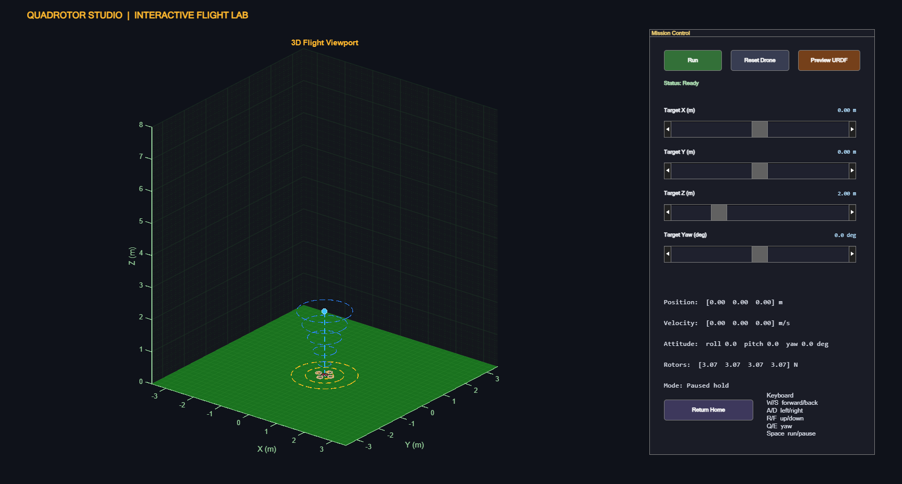
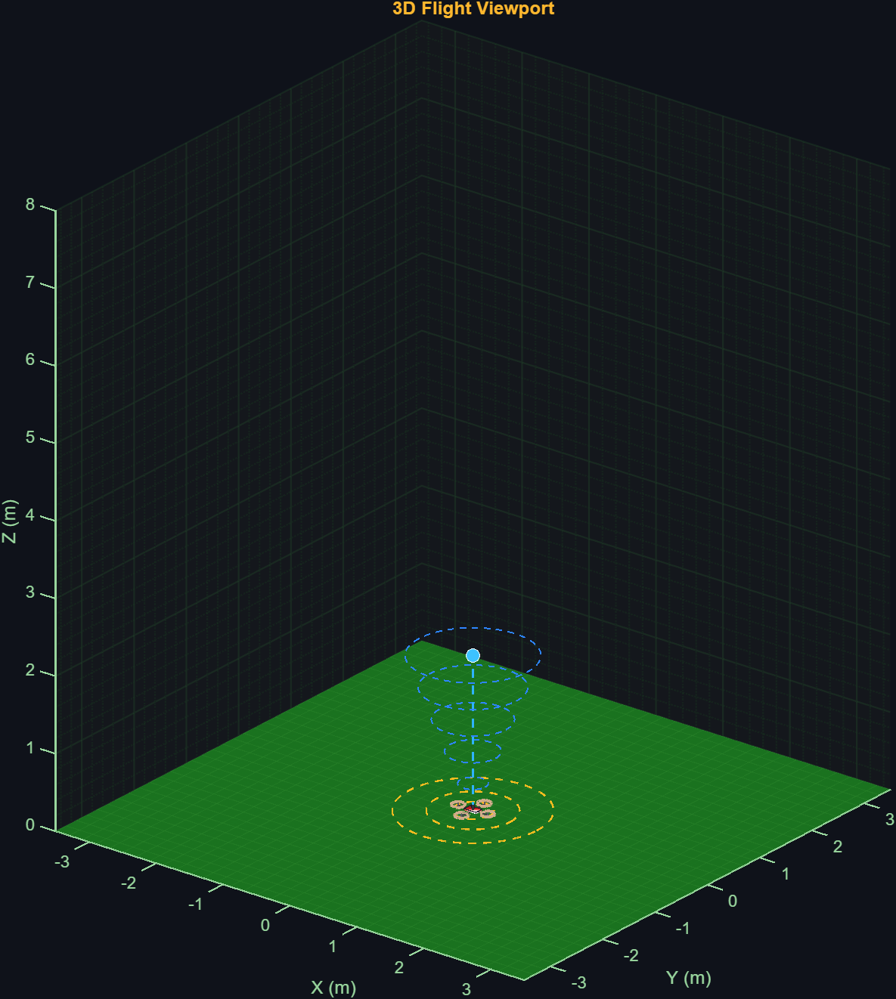

<div align="center">

# 🚁 Quadrotor Studio

### Interactive MATLAB Quadrotor Simulator with URDF Visualization & PID Control

[](https://www.mathworks.com/products/matlab.html)
[](LICENSE)
[](https://github.com/TejasRaut15k/quadrotor-studio)
[](https://github.com/TejasRaut15k/quadrotor-studio/pulls)

**A compact robotics simulation environment for real-time quadrotor experimentation.**  
**No Simulink. No Simscape. Pure MATLAB.**

[Features](#-features) · [Quick Start](#-quick-start) · [Controls](#-controls) · [Architecture](#-architecture) · [Screenshots](#-screenshots)

</div>

---

## 📸 Screenshots

### Full Interactive Simulator
<div align="center">

</div>

> The main simulator interface features a real-time 3D flight viewport with trajectory trail, interactive target sliders for X/Y/Z position and yaw, and a URDF-rendered quadrotor model with colored propellers.

---

### URDF Model Preview
<div align="center">

</div>

> Standalone URDF preview mode showing the colored quadrotor model with body frame, motor arms, and propeller discs rendered using MATLAB's Robotics System Toolbox.

---

## ✨ Features

<table>
<tr>
<td width="50%">

### 🎮 Interactive Simulator
- **Real-time 3D Flight** viewport with trajectory trail
- **URDF-based Rendering** — colored drone model with propellers
- **Interactive Target Control** — sliders for position (X, Y, Z) and yaw
- **Keyboard Shortcuts** — WASD + RF for quick navigation
- **Play / Pause** — freeze simulation at any point
- **Home Reset** — instantly return to hover position

</td>
<td width="50%">

### 🧠 Control System
- **6-DOF PID Controller** — roll, pitch, yaw, and altitude
- **Anti-Windup** — integral clamping to prevent overshoot
- **Open vs Closed-Loop** comparison plots
- **Adjustable PID Gains** — `Kp`, `Ki`, `Kd` tuning
- **Rigid-Body Dynamics** — Euler-angle based state propagation
- **Configurable Parameters** — mass, drag, thrust limits

</td>
</tr>
</table>

---

## 🚀 Quick Start

### Prerequisites

| Requirement | Version |
|------------|---------|
| **MATLAB** | R2023b or newer |
| **Robotics System Toolbox** | Required for URDF import & visualization |
| **Control System Toolbox** | Required for PID tuning utilities |

### Installation

```bash
# Clone the repository
git clone https://github.com/TejasRaut15k/quadrotor-studio.git
```

### Running the Full Simulator

```matlab
% Open MATLAB, navigate to the project folder, and run:
cd('path/to/quadrotor-studio/QuadrotorStudio')
start_quadrotor_studio
```

### Running the PID Altitude Demo

```matlab
% Standalone vertical PID control script with live drone visualization:
cd('path/to/quadrotor-studio/QuadrotorStudio')
run('quadrotor_pid_live_script.m')
```

### Previewing the URDF Model Only

```matlab
% Opens a standalone 3D viewer for the quadrotor URDF model:
cd('path/to/quadrotor-studio/QuadrotorStudio')
preview_quadrotor_urdf
```

---

## 🎮 Controls

| Key | Action |
|-----|--------|
| `W` / `S` | Move target **forward / backward** |
| `A` / `D` | Move target **left / right** |
| `R` / `F` | Move target **up / down** |
| `Q` / `E` | Rotate target **yaw** (left / right) |
| `Space` | **Run / Pause** the simulation |
| `H` | **Home** — return target to hover position |

---

## 🏗️ Architecture

### System Overview

```
┌──────────────────────────────────────────────────────────────┐
│                    QUADROTOR STUDIO                           │
├──────────────────────────────────────────────────────────────┤
│                                                              │
│  ┌─────────────┐    ┌──────────────┐    ┌────────────────┐  │
│  │  User Input  │───►│ PID Controller│───►│  Dynamics Step │  │
│  │  (Sliders/   │    │ (6-DOF)      │    │  (Rigid Body)  │  │
│  │   Keyboard)  │    │              │    │                │  │
│  └─────────────┘    └──────────────┘    └───────┬────────┘  │
│                                                  │           │
│                           ┌──────────────────────▼────────┐  │
│                           │   3D Visualization Engine     │  │
│                           │   (URDF Model + Trajectory)   │  │
│                           └───────────────────────────────┘  │
│                                                              │
└──────────────────────────────────────────────────────────────┘
```

### PID Control Loop

```
                    ┌───────────┐
  Target ──────────►│           │
  Position          │  Error    │──── e(t) ──┐
                    │  Calculator│            │
  Current ─────────►│           │            │
  Position          └───────────┘            │
                                             ▼
                                  ┌─────────────────────┐
                                  │   PID Controller     │
                                  │                     │
                                  │  u = Kp·e + Ki·∫e   │
                                  │      + Kd·(de/dt)   │
                                  │                     │
                                  │  Anti-windup:       │
                                  │  |∫e| ≤ maxIntegral │
                                  └──────────┬──────────┘
                                             │
                                             ▼
                                  ┌─────────────────────┐
                                  │  Thrust Saturation   │
                                  │  0 ≤ T ≤ maxThrust  │
                                  └──────────┬──────────┘
                                             │
                                             ▼
                                  ┌─────────────────────┐
                                  │  Quadrotor Dynamics  │
                                  │  F = ma → z̈, ż, z  │
                                  └─────────────────────┘
```

### Default PID Parameters

| Parameter | Value | Description |
|-----------|-------|-------------|
| `Kp` | 14.0 | Proportional gain |
| `Ki` | 2.8 | Integral gain |
| `Kd` | 8.0 | Derivative gain |
| `m` | 1.25 kg | Quadrotor mass |
| `g` | 9.81 m/s² | Gravitational acceleration |
| `k` | 0.12 | Throttle-to-thrust coefficient |
| `maxThrust` | 25.0 N | Maximum thrust limit |
| `maxIntegral` | 8.0 | Anti-windup clamp |
| `dt` | 0.03 s | Simulation timestep |

---

## 📁 Project Structure

```
quadrotor-studio/
├── README.md                          # This file
├── LICENSE                            # MIT License
├── docs/
│   ├── quadrotor_studio_full.png      # Full simulator screenshot
│   └── quadrotor_studio_preview.png   # URDF preview screenshot
│
└── QuadrotorStudio/                   # Main MATLAB project
    ├── start_quadrotor_studio.m       # 🚀 Entry point — launches full simulator
    ├── quadrotor_pid_live_script.m    # 📊 PID altitude demo with live plots
    ├── preview_quadrotor_urdf.m       # 👀 URDF-only preview
    ├── colored_quadrotor.urdf         # 🤖 Quadrotor 3D model definition
    │
    ├── src/                           # Core simulation modules
    │   ├── QuadrotorStudioApp.m       # Main app — UI, rendering, event loop
    │   ├── quadrotorControlStep.m     # PID controller implementation
    │   ├── quadrotorDynamicsStep.m    # Rigid-body dynamics (Euler angles)
    │   ├── quadrotorDefaultParams.m   # Default physical parameters
    │   ├── quadrotorInitialState.m    # Initial state vector
    │   └── quadrotorWrapToPi.m        # Angle wrapping utility
    │
    └── assets/
        └── quadrotor_drone.urdf       # Alternative URDF model
```

---

## 🛠️ Technical Details

### URDF Model
The quadrotor is defined using URDF (Unified Robot Description Format), which is parsed by MATLAB's `importrobot()` function. The model includes:
- **Base body** — central fuselage
- **4 motor arms** — extending from the body
- **4 propeller discs** — color-coded (red/blue) for orientation
- **Prismatic joint** — for altitude visualization

### Dynamics Engine
The simulation uses simplified rigid-body dynamics with Euler-angle representation:
- **Translational dynamics**: `F = ma` with gravity and drag
- **Rotational dynamics**: Torque-based angular acceleration
- **Ground collision**: Height clamped to `z ≥ 0` with velocity reset

### Modular Design
Each component is a standalone MATLAB function, making it easy to:
- Swap the PID controller for MPC or LQR
- Replace dynamics with a higher-fidelity model
- Add sensors (IMU simulation, noise models)
- Integrate with Simulink or ROS

---

## 🔮 Future Roadmap

- [ ] Horizontal position PID control (X, Y tracking)
- [ ] Wind disturbance simulation
- [ ] Waypoint following mode
- [ ] Battery discharge model
- [ ] Sensor noise simulation (IMU, barometer)
- [ ] Trajectory recording and playback
- [ ] Export to Simulink model
- [ ] Multi-drone formation control

---

## 🤝 Contributing

Contributions are welcome! Feel free to:

1. **Fork** the repository
2. **Create** a feature branch (`git checkout -b feature/lqr-controller`)
3. **Commit** your changes (`git commit -m 'Add LQR altitude controller'`)
4. **Push** to the branch (`git push origin feature/lqr-controller`)
5. **Open** a Pull Request

---

## 📜 License

This project is licensed under the **MIT License** — see the [LICENSE](LICENSE) file for details.

---

<div align="center">

**Built for robotics education & research 🤖**

*MATLAB · URDF · PID Control · 3D Visualization*

[](https://github.com/TejasRaut15k/quadrotor-studio)

</div>
